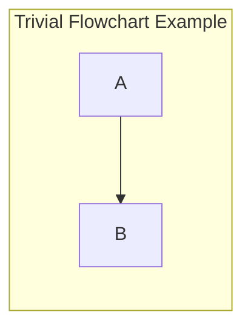
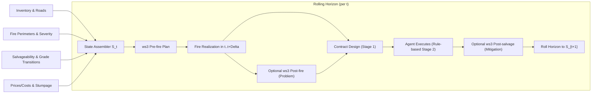
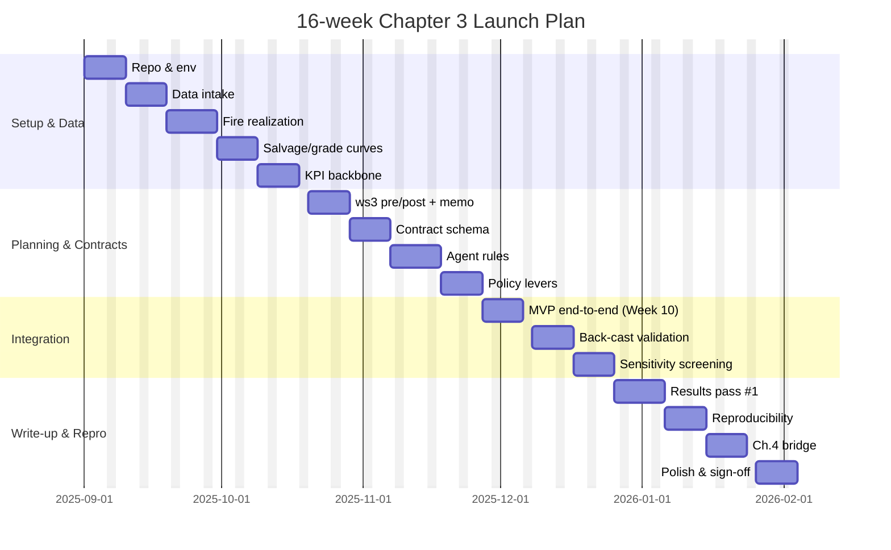

This document shows a few examples of creating mermaid diagrams.

The example markdown code blocks below should render from a codeserver development environment if the *Mermaid Chart* extension is installed correctly. The preview pane should let you download the rendered figures as PNG or SVG files (which you can copy to your LaTeX thesis or paper project).

You can also save mermaid code into stand-alone `*.mmd` source code (plain text) files, and render these to LaTeX-compatible formats (e.g., PDF) using the `mmdc` command (provided by the `mermaid-cli` package). You might need root (`sudo`) permissions to install the CLI tool, so codeserver extension route might be the path of least resistance (depending on your dev environment setup).

```bash
npm install -g @mermaid-js/mermaid-cli
```

To render one of the sample mermaid code files included in this directory, you can run the following command from a shell (assuming CWD set to this directory).

```bash
mmdc -i flowchart-example.mmd -o flowchart-example.pdf -t neutral -p puppeteer-config.json
```

The `mermaid-cli` package can be tricky to get installed correctly in some codeserver (e.g., containerized, headless, restricted permissions) environments, so if that is the case for you just stick with the codeserver extension. You can directly include SVG graphics in LaTeX, so that should work.

# Example 1: flowcharts





# Example 2: Gantt chart


